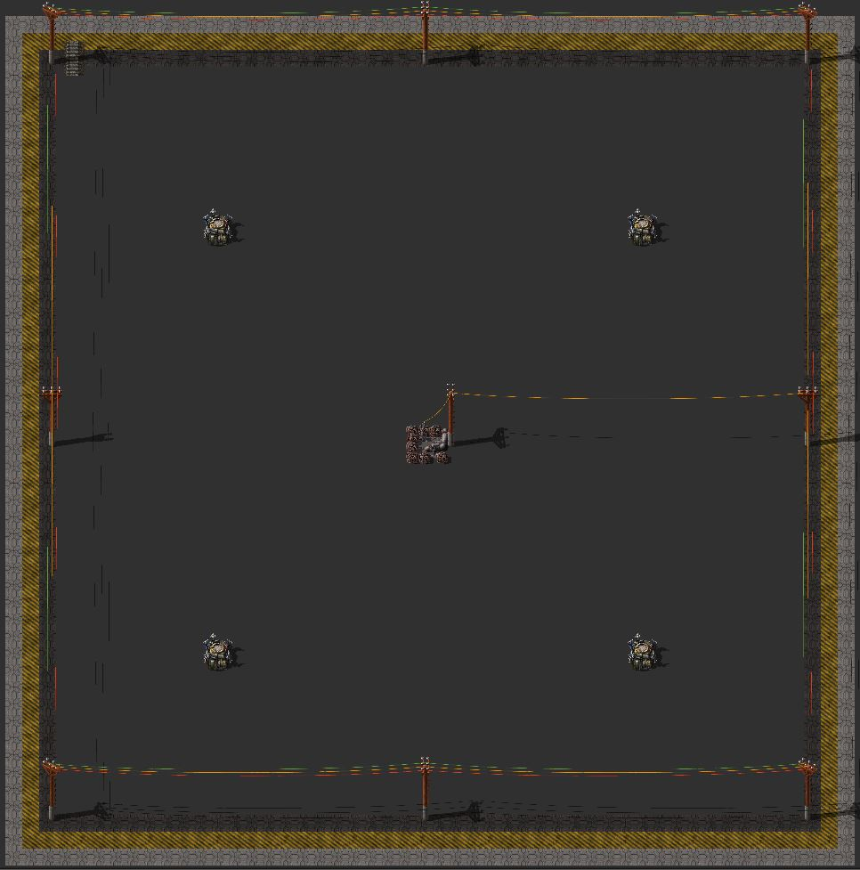

## Recull de planells

Companyes aquí tenim un recull de planells que estem utiltizant a la partida de Factorio actual. Ja anire endreçant una mica.

### Organització de la base

* *[Blocs basics d'urbanització](blocs-basics.md):* Conte les cel·les bàsiques que hem acordat.

* *[Blocs producció energia](blocs-energia.md):* Conte blocs de producció d'energia

## Com contribuir:

Podeu fer un fork del repo i afegir un arxiu .md amb els diferents planells que us interesa compartir i mantenir actualitzats si voleu. Feu un merge request i els actualitzare. EL format per escriure es markdown o html. Mireu algu doc meu per veure exemple.

Afegiu la imatge del planell a la carpeta ````\images````.

Despres podeu fer servir aquest bloc d'exemple per incorporar un planell a algun dels llibres:

```Markdown

## <nom del planell>

Poseu aquí una descripció (podeu usar markdown per fer *negretes* o llistes)



Cadena del planell:

    <poseu la cadena amb 4 espais previs, es important l'intro abans de la cadena o no es veura be.>

````